# 区别
同步通信和异步通信
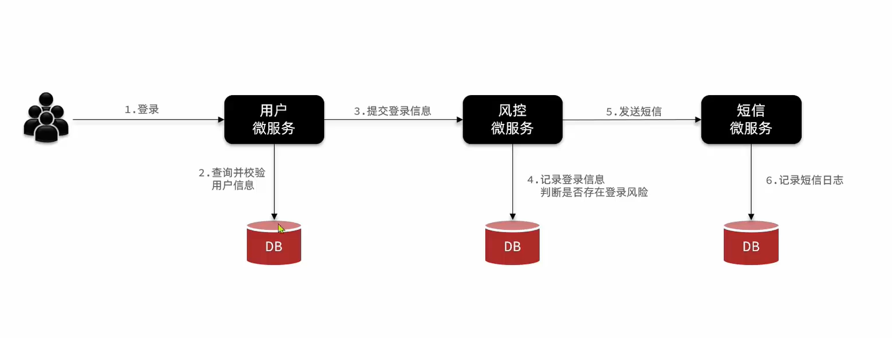
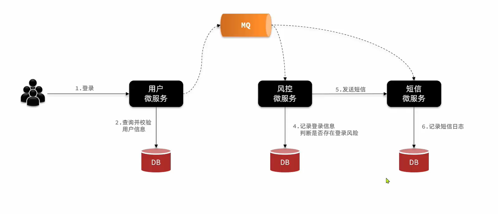

# 目录
基础可以应对工作，高级应对面试考察
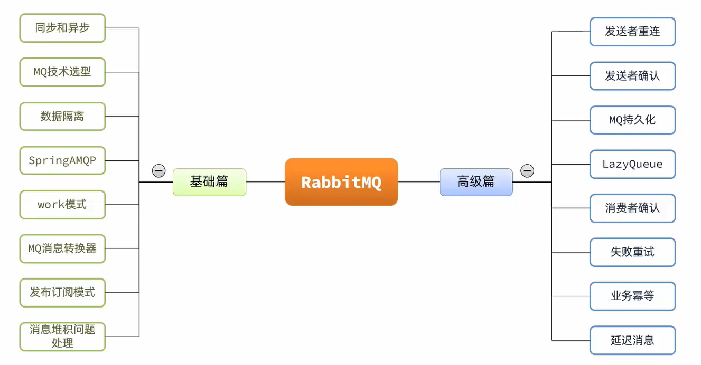

# 比较
- 拓展性差：
- 性能下降：随着业务需求的不断变更和增长，同步调用的耗时逐渐增长，性能逐渐下降
- 级联失败：前面完成了，后面的失败了，导致处理失败。下一步的操作依赖于上一步的操作
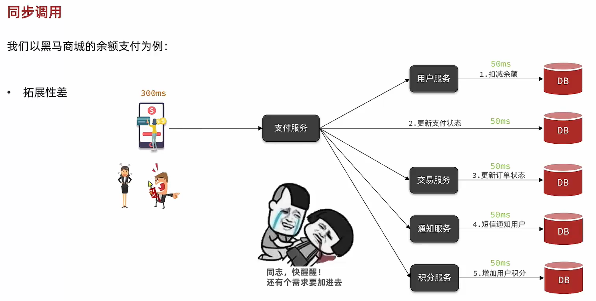
小结 比较
- 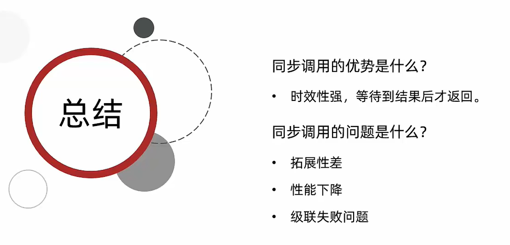
# 异步调用
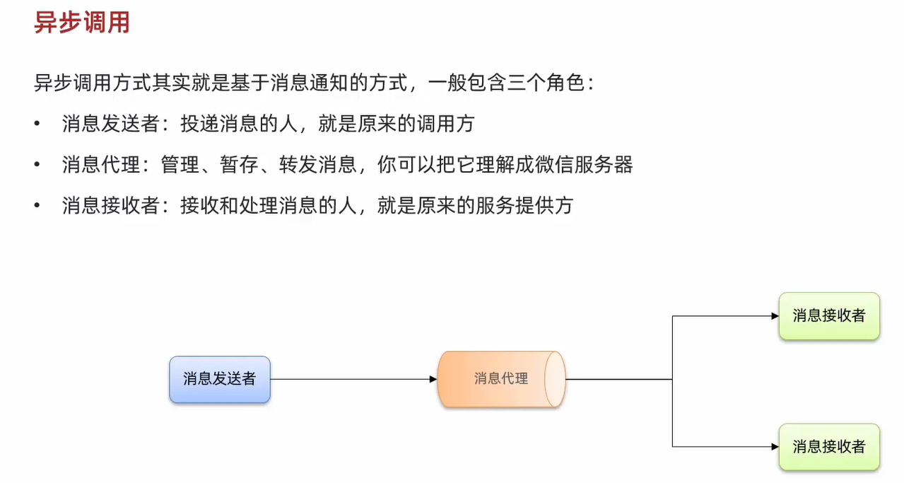
操作12必须同步，操作3不用同步，用异步即可
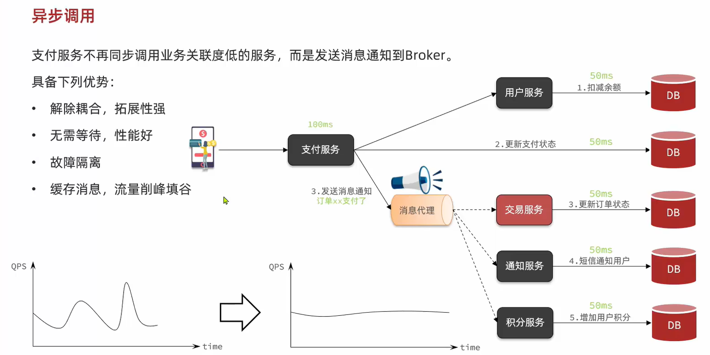
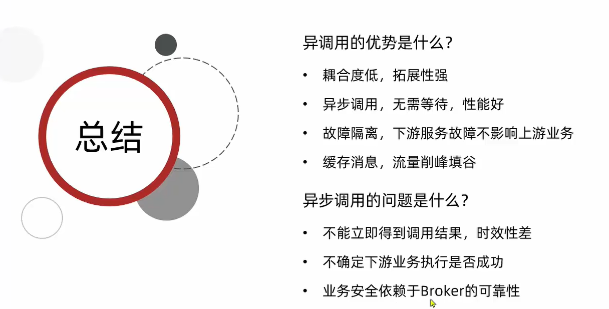
可靠性 依赖于 消息代理

## 使用场景
- 对于对方的执行结果不关心：MQ要处理的业务对整个任务不是非常重要
- 对于性能较高的情况：对于流量特别大的场景，不能使用同步通信

# MQ技术选型 Message Queue
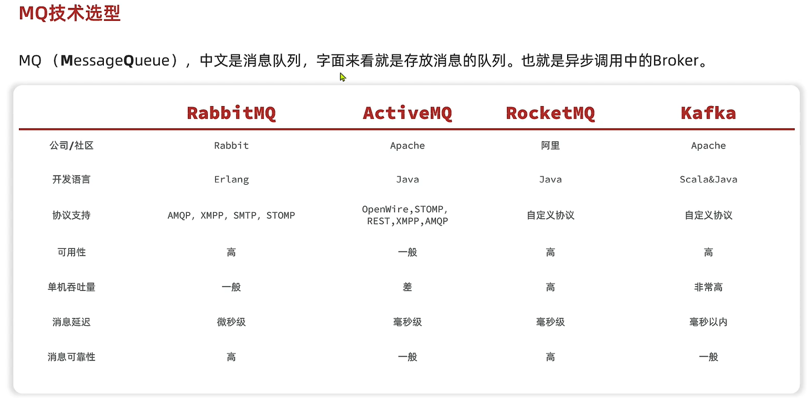

# RMQ 核心架构


交换机Exchanger 只负责路由和转发消息，不会存储消息

- 在Queue里新建队列
- 在Exchanger里面新建交换机
- 在Exchanger里面编辑信息负载Payload 并发布Publish

# 数据隔离
每个项目应该创建一个用户
为这个用户创建一个虚拟主机
测试不同虚拟主机之间的数据隔离的特性


# Java客户端操作

生产者
```java
package com.itheima.publisher;

import org.springframework.boot.SpringApplication;
import org.springframework.boot.autoconfigure.SpringBootApplication;

import java.util.LinkedList;
import java.util.Queue;

@SpringBootApplication
public class PublisherApplication {
    public static void main(String[] args) {
        SpringApplication.run(PublisherApplication.class);
        Queue<Integer> q = new LinkedList<>();

    }
}

```
消费之
```java
// MqListener.java
package com.itheima.consumer.listeners.MqListener;

import lombok.extern.slf4j.Slf4j;
import org.springframework.amqp.rabbit.annotation.RabbitListener;
import org.springframework.stereotype.Component;

@Slf4j
@Component
public class MqListener {
    @RabbitListener(queues = "simple.queue")
    public void listenSimpleQueue(String msg){
        System.out.println("消费者收到了simple.queue的消息：【" + msg + "】");
    }
}
// ConsumerApplication.java
package com.itheima.consumer;

import org.springframework.boot.SpringApplication;
import org.springframework.boot.autoconfigure.SpringBootApplication;

@SpringBootApplication
public class ConsumerApplication {
    public static void main(String[] args) {
        SpringApplication.run(ConsumerApplication.class, args);
    }
}

```

# 一个案例需求分析 如何解决消息堆积问题 -> 使用 work 模型

1个publisher 2个消费者
50条消息被消费50次。

50条消息被平均分配给了两个消费者
并没有考虑不同消费者的性能，而分配不同的任务数量

解决办法：在配置文件中加入下面的配置信息
```yaml
logging:
  pattern:
    dateformat: MM-dd HH:mm:ss:SSS

spring:
  rabbitmq:
    host: 118.89.147.177
    port: 5672
    virtual-host: /hmall
    username: hmall
    password: hmall
    listener:
      simple:
        prefetch: 1
```
变成能者多劳
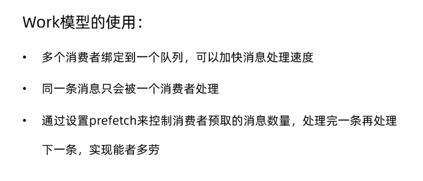

# Fanout 交换机
三种
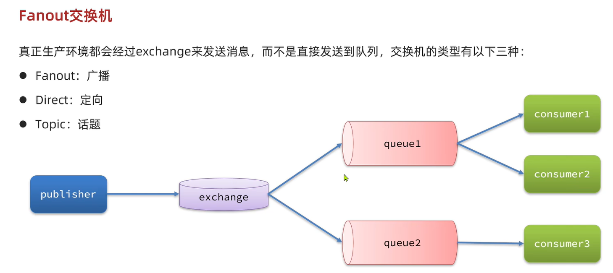
三种
- Fanout 广播 \
Publisher 把消息交给 Fanout 交换机后 交换机会把当前的消息转发给每一个 consumer
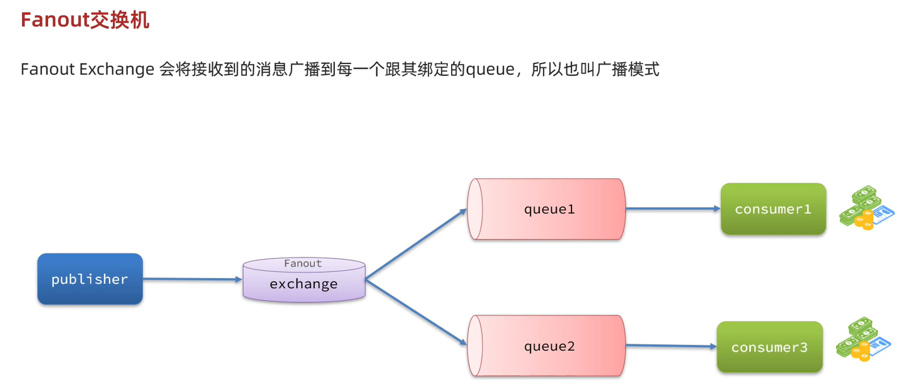
按照下图进行简单的测试
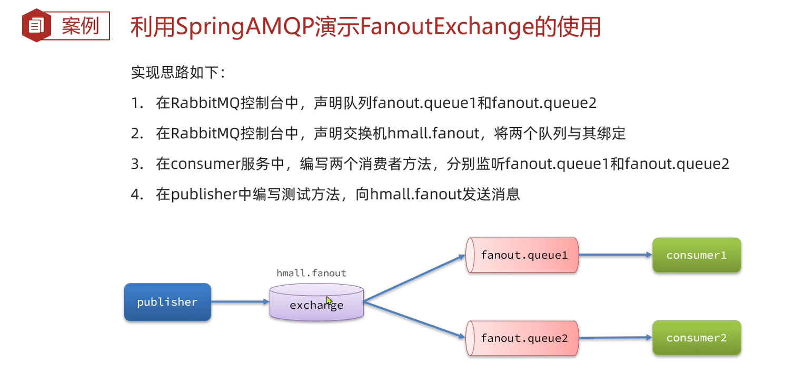
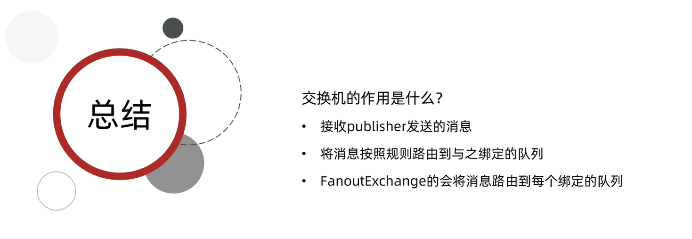
- Direct 定向路由\
每个交换机Exchanger与每个队列Queue要事先定义好两者之间的BindKey
然后，发布者Publisher发送消息时候，要指定发消息的BindKey
Exchanger根据BindKey发送到指定的Queue
可以自由实现1对1,1对n
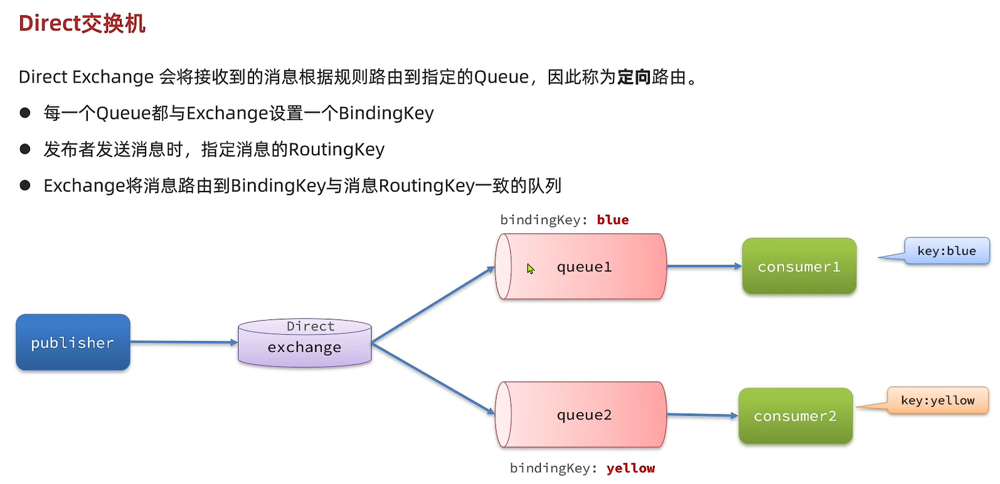
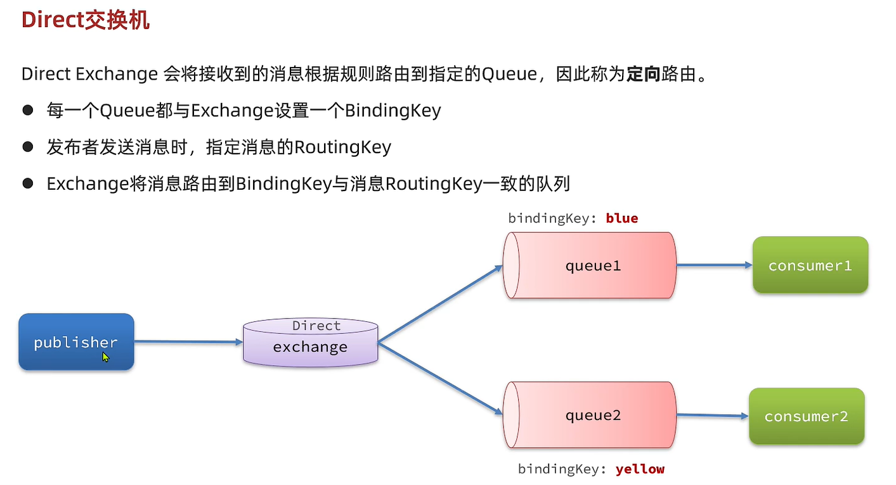


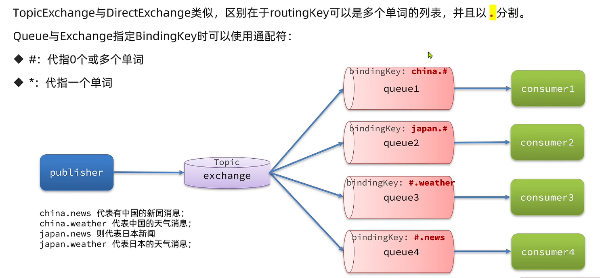

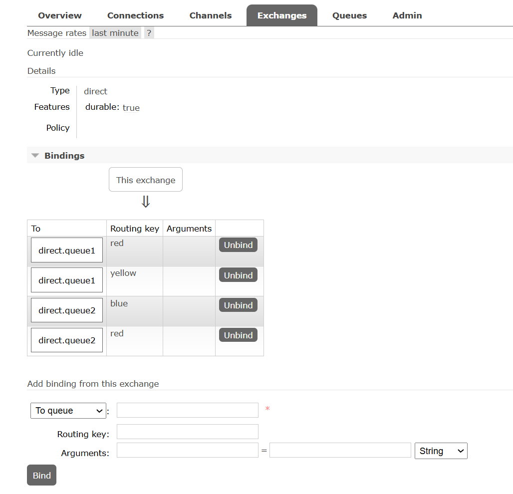
- Topic 话题 \
Topic Exchanger 交换机 
绑定BindKey
  通配符减少BindKey绑定的繁琐
可以使用通配符 # 和 *
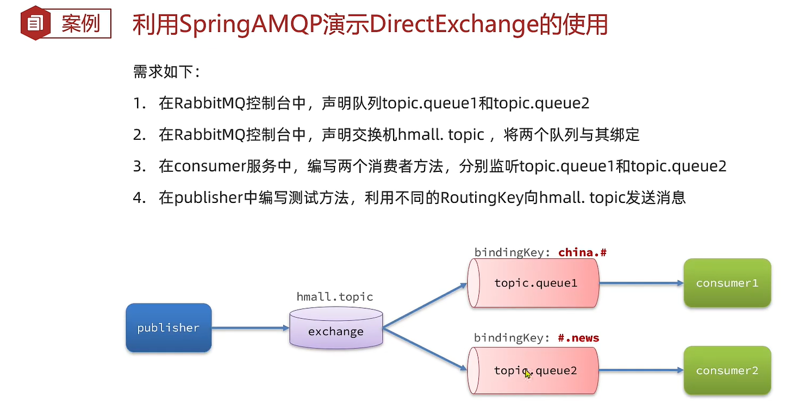
Topic类型的交换机功能最强大，最推荐使用
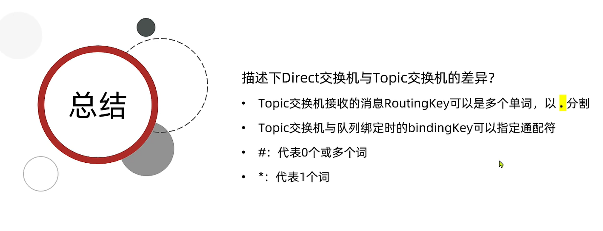

# Java 创建 队列Queue、交换机Exchanger和绑定关系 方式一
# Java 创建 队列Queue、交换机Exchanger和绑定关系 方式二
基于交换机和注解
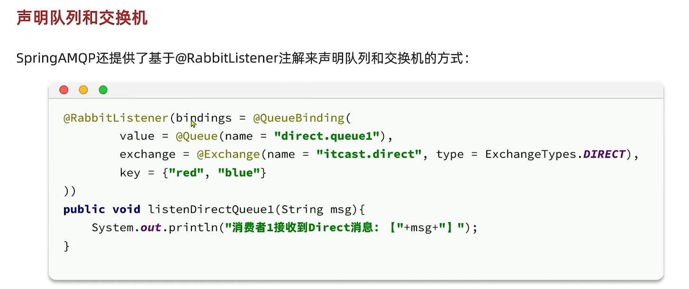
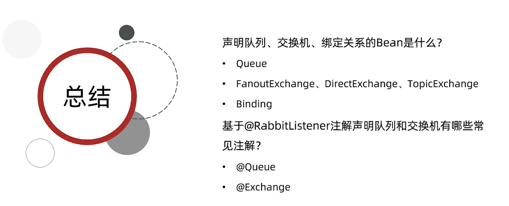

```java
@RabbitListener(bindings = @QueueBinding(
            value = @Queue(name = "direct.queue2", durable = "true"),
            exchange = @Exchange(name = "hmall.direct", type = ExchangeTypes.DIRECT),
            key = {"red", "yellow"}
    ))
public void listenDirectQueue1(String msg){
    System.out.println("消费者1 yellow 收到了 direct.queue的消息：【" + msg + "】");
}
```

# Java 消息转换器
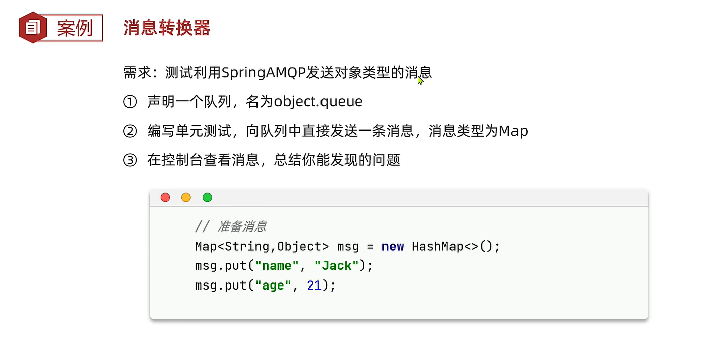
对于对象类型的消息，会对其进行序列化处理，但是默认的序列化方法存在安全漏洞，\
所以不推荐使用，建议使用JSON序列化进行操作
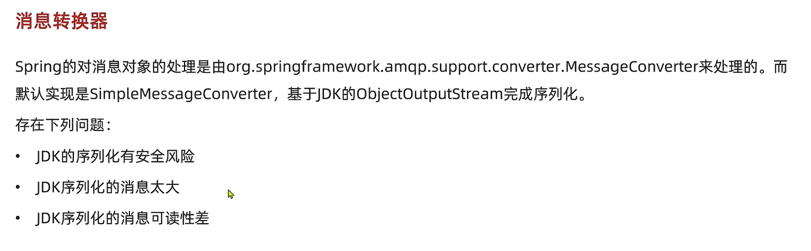


