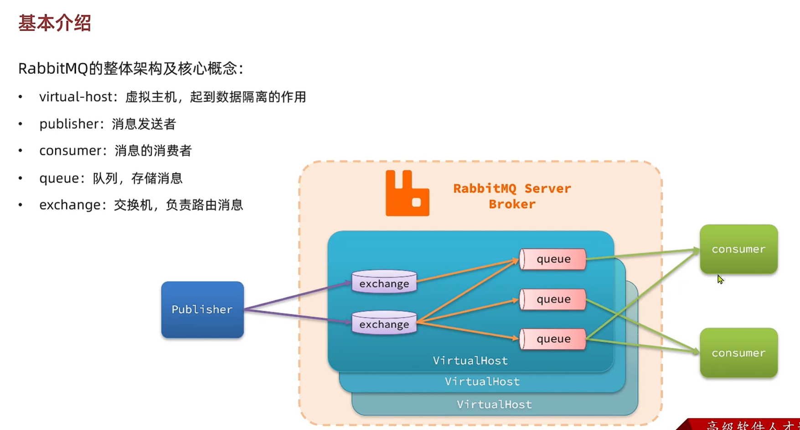
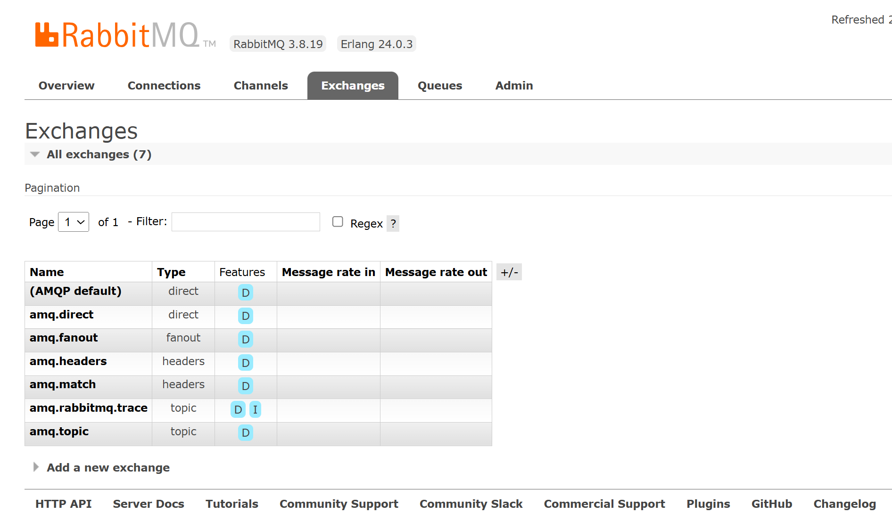

# 区别
同步通信和异步通信

# 目录
基础可以应对工作，高级应对面试考察

# 比较
- 拓展性差：
- 性能下降：随着业务需求的不断变更和增长，同步调用的耗时逐渐增长，性能逐渐下降
- 级联失败：前面完成了，后面的失败了，导致处理失败。下一步的操作依赖于上一步的操作

小结 比较
- 
# 异步调用

操作12必须同步，操作3不用同步，用异步即可

可靠性 依赖于 消息代理

## 使用场景
- 对于对方的执行结果不关心：MQ要处理的业务对整个任务不是非常重要
- 对于性能较高的情况：对于流量特别大的场景，不能使用同步通信

# MQ技术选型 Message Queue

# RMQ 核心架构

交换机Exchanger 只负责路由和转发消息，不会存储消息

- 在Queue里新建队列
- 在Exchanger里面新建交换机
- 在Exchanger里面编辑信息负载Payload 并发布Publish

# 数据隔离
每个项目应该创建一个用户
为这个用户创建一个虚拟主机
测试不同虚拟主机之间的数据隔离的特性

# Java客户端操作

